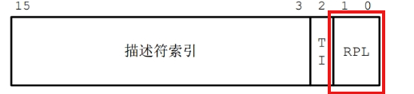
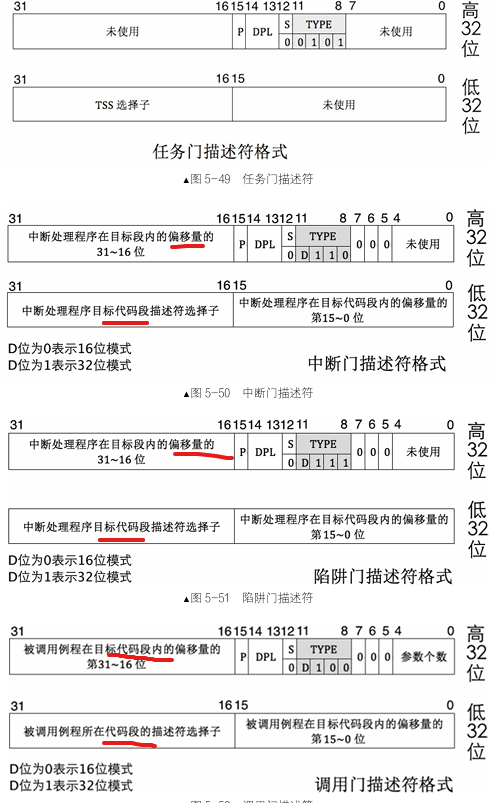

# os
实现一个操作系统，每个版本可以独立编译运行。
version20(包括)之后的版本用one_key_to_make_and_run_os.sh脚本一键编译安装启动os。之前版本用install_os.sh脚本启动

#### **version0**
bios 跳转到mbr
#### **version1**
添加loader,mbr跳转到loader中执行指令
#### **verison2**
构造gdt全局描述符表，从16位实模式到32位保护模式
[https://github.com/yyuanl/os/blob/main/version2/version2.md](https://github.com/yyuanl/os/blob/main/version2/version2.md)
#### **version3**
使用例程检测内存大小
[https://github.com/yyuanl/os/blob/main/version3/version3.md](https://github.com/yyuanl/os/blob/main/version3/version3.md)
#### **version4**
构造二级页表，开启分页模式，从物理地址到虚拟地址
[https://github.com/yyuanl/os/blob/main/version4/version4.md](https://github.com/yyuanl/os/blob/main/version4/version4.md)
#### **version5**
编译c语言内核，死循环，链接成可执行elf文件，读取到内存中，解析程序段并拷贝到对应地址，跳转到入口执行
#### 特权级
指令放在代码中，代码段寄存器cs放段选择子，选择子低两位RPL表示代码请求资源能力的等级CPL

段描述符有DPL字段，表达段的权级

段选择子有RPL字段，低2位表示请求权级
#### 门
一块内存数据结构，描述一段特殊程序的信息，说明这段程序地址在哪。

任务门描述符可以放在GDT、LDT和IDT。调用门可以位于GDT、LDT中，中断门和陷阱门仅位于IDT中。

- 调用门：
call 和jmp 指令后接调用门选择子为参数，以调用函数例程的形式实现从低特权向高特权转移，可用来实现系统调用。call指令使用调用门可以实现向高特权代码转移，jmp指令使用调用门只能实现向平级代码转移。用户调用内核，如何特权级需要提升，则要使用高特权级栈，往里压入用户的栈段选择子SS、用户的栈顶ESP、用户参数、用户代码段寄存器CS、用户指令寄存器EIP，返回是用于回到用户状态。s
- 中断门：
以int 指令主动发中断的形式实现从低特权向高特权转移
- 任务门：
任务以任务状态段 TSS 为单位，用来实现任务切换，它可以借助中断或指令发起。当中断发生时，如果对应的中断向量号是任务门，则会发起任务切换。也可以像调用门那样，用call或jmp指令后接任务门的选择子或任务TSS的选择子。
- 用户程序想要获取物理内存大小，该数据存储在loader的数据段中。
  - call 调用门选择子，该门描述符DPL是3，为了让用户程序能用。该门选择子RPL是3
  - 用户程序的CPL RPL是3，调用门时，满足CPL<=DPL,RPL<=DPL，检查通过
  - 假设调用门指向的程序为X,则X_DPL是0，因为他是内核程序。再次检查，用户程序CPL>=X_DPL,通过，可以使用该调用门
  - 处理器把CPL设置0内核特权级，记录在CS.RPL中。
  - X参数是用户提交的结果缓冲区段选择子和偏移量，避免缓冲区指向内核，将用户程序提交的选择子设置为用户程序的CPL，即3
  - 处理器固件将用户提交参数复制到0级栈
    - 用户正常提交的缓冲区参数指向用户区，则内核将要访问的段DPL是3，满足CPL<=DPL,RPL<=DPL，0<=3,3<=
    - 用户搞破坏，缓冲区段指向内核，则目标段DPL是0，不满足CPL<=DPL,RPL<=DPL，0<=0,3<=0，抛出异常
#### **version6**
实现打印字符功能print.s，main.c调用汇编
[https://github.com/yyuanl/os/blob/main/version6/version6.md](https://github.com/yyuanl/os/blob/main/version6/version6.md)
#### **version7**
再封装打印字符串和16进制
[https://github.com/yyuanl/os/blob/main/version7/version7.md](https://github.com/yyuanl/os/blob/main/version7/version7.md)
#### **version8**
根据硬件约定的pic，idt，开启中断
[https://github.com/yyuanl/os/blob/main/version8/version8.md](https://github.com/yyuanl/os/blob/main/version8/version8.md)

#### **version9**
优化中断处理函数，汇编c中定义的处理的函数
[https://github.com/yyuanl/os/blob/main/version9/version9.md](https://github.com/yyuanl/os/blob/main/version9/version9.md)

#### **version10**
配置时钟中断芯片，加快中断。
[https://github.com/yyuanl/os/blob/main/version10/version10.md](https://github.com/yyuanl/os/blob/main/version10/version10.md)

#### **version11**
利用中断，实现ASSERT断言，使用makefile编译链接内核可执行文件
[https://github.com/yyuanl/os/blob/main/version11/version11.md](https://github.com/yyuanl/os/blob/main/version11/version11.md)

#### **version12**
封装字符串操作
[https://github.com/yyuanl/os/blob/main/version12/version12.md](https://github.com/yyuanl/os/blob/main/version12/version12.md)

#### **version13**
内存管理，使用位图分页管理内存，构建内核、用户内存池、虚拟地址池
[https://github.com/yyuanl/os/blob/main/version13/version13.md](https://github.com/yyuanl/os/blob/main/version13/version13.md)

#### **version14**
利用内存管理系统，分配连续的多页内存
[https://github.com/yyuanl/os/blob/main/version14/version14.md](https://github.com/yyuanl/os/blob/main/version14/version14.md)

#### **version15**
设计线程数据结构pcb和线程栈，分配一页用来设置线程信息，启动执行一个线程
[https://github.com/yyuanl/os/blob/main/version15/version15.md](https://github.com/yyuanl/os/blob/main/version15/version15.md)

#### **version16**
实现线程切换，使用队列调度
[https://github.com/yyuanl/os/blob/main/version16/version16.md](https://github.com/yyuanl/os/blob/main/version16/version16.md)

#### **version17**
实现二元信号量pv操作，用二元信号量实现锁，利用锁保证控制台输出同步
[https://github.com/yyuanl/os/blob/main/version17/version17.md](https://github.com/yyuanl/os/blob/main/version17/version17.md)

#### **version18**
实现键盘驱动
[https://github.com/yyuanl/os/blob/main/version18/version18.md](https://github.com/yyuanl/os/blob/main/version18/version18.md)

#### **version19**
实现环形缓冲区，获取用户完整输入
[https://github.com/yyuanl/os/blob/main/version19/version19.md](https://github.com/yyuanl/os/blob/main/version19/version19.md)

#### **version20**
实现用户进程，构造进程独立页表、虚拟地址池，构造tss描述符来切换任务，构造3特权级
[https://github.com/yyuanl/os/blob/main/version20/version20.md](https://github.com/yyuanl/os/blob/main/version20/version20.md)

#### **version21**
实现getpid系统调用
[https://github.com/yyuanl/os/blob/main/version21/version21.md](https://github.com/yyuanl/os/blob/main/version21/version21.md)

#### **version22**
实现printf函数，实现内存管理malloc free系统调用
[https://github.com/yyuanl/os/blob/main/version22/version22.md](https://github.com/yyuanl/os/blob/main/version22/version22.md)