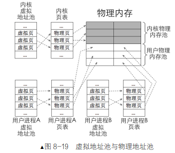
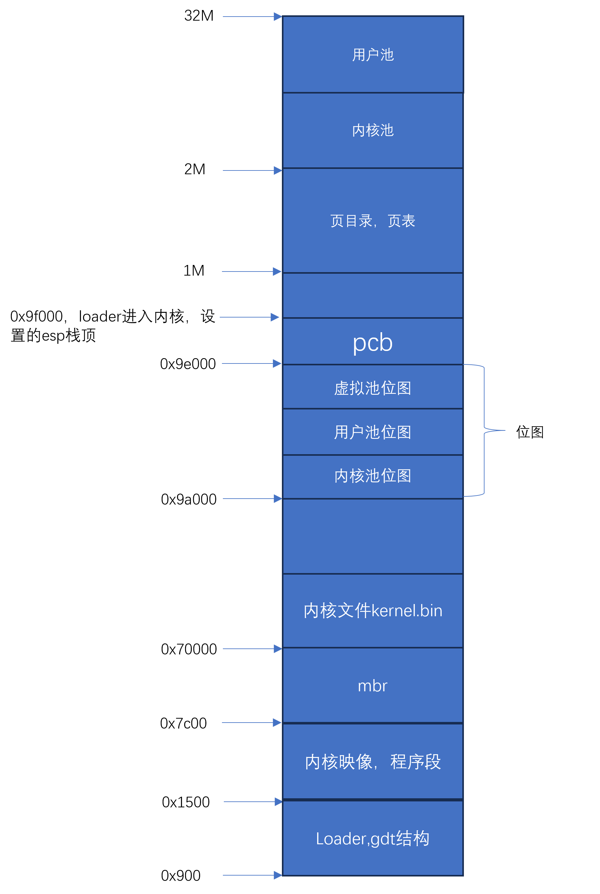
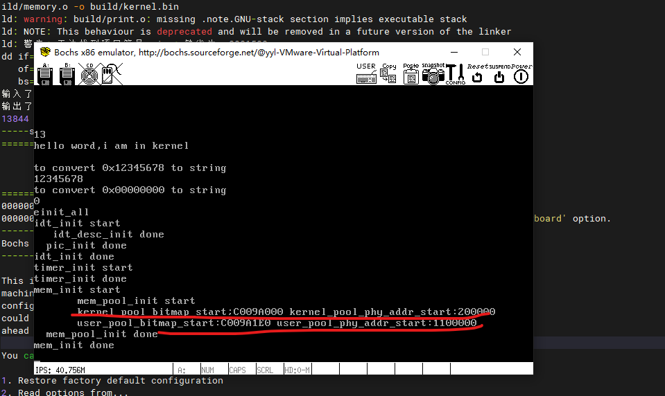

- vscode远程，安装c插件后，代码提示：
  Ctrl Shift p修改c_cpp_properties.json
```
{
    "configurations": [
        {
            "name": "Linux",
            "includePath": [
                "${workspaceFolder}/**",
                "/opt/scode_config/**"
            ],
            "defines": [],
            "compilerPath": "/usr/bin/gcc",
            "cStandard": "c99",
            "cppStandard": "c++98",
            "intelliSenseMode": "linux-gcc-x64"
        }
    ],
    "version": 4
}
```
将以下内容写到/opt/scode_config目录下的文件中
```
{
    "workbench.colorTheme": "Default Dark+",
    "cmake.configureOnOpen": true,
    "window.zoomLevel": 2,
    "editor.minimap.enabled": true,
    "C_Cpp.autocomplete": "Default",
    "[cpp]": {
        "editor.quickSuggestions": true
    },
    "[c]": {
        "editor.quickSuggestions": true
    }
}
```

- 位图
- 内存管理：将用户和内核物理内存池分别用位图管理，虚拟地址池也管理为了在分页机制下虚拟地址到物理地址的转换，每个进程对应一个虚拟地址池，因为每个进程拥有4G虚拟地址
  

  整个物理内存划分：
  {:height="80%" width="50%"}

- 初始化内存池mem_pool_init：
  - page_table_size：它用来记录页目录表和页表占用的字节大小，总大小等于页目录表大小+页表大小。页目录大小为 1 页框，第 0 和第 768 个页目录项指向同一个页表，它们共享这 1 页框空间，第 769～1022 个页目录项共指向 254 个页表，故页表总大小等于56*PG_SIZE，共计 0x200000 字节，2MB。注意，最后一个页目录项（第 1023 个 pde）指向页目录表，因此不重复计算空间。


- 运行效果：
    {:height="60%" width="60%"}