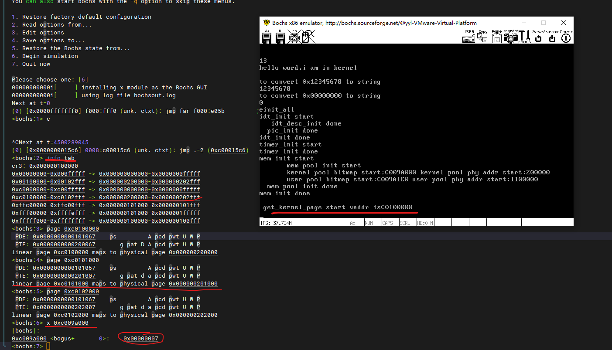

- 关键函数：
  - 输入虚拟地址返回该地址的pde地址的虚拟地址，利用PDE最后一个元素执行PED起始地址
  - 输入虚拟地址返回该地址的pte地址的虚拟地址,0xffc00000高10位就是1023
```
uint32_t* pte_ptr(uint32_t vaddr) {
    //拼凑出一个虚拟地址 用该虚拟地址可以访问到vaddr的pte地址
    uint32_t* pte = (uint32_t*)(0xffc00000 + ((vaddr & 0xffc00000) >> 10) + PTE_IDX(vaddr)*4);
    return pte;
}

// 计算出虚拟地址vaddr对应pde页表目录项物理地址的对应虚拟地址
uint32_t* pde_ptr(uint32_t vaddr) {
    uint32_t* pde = (uint32_t*)((0xfffff000) + PDE_IDX(vaddr) * 4);
    return pde;
}
```
  - 新建pde项(元素内容不指定一个页表) pte项(元素内容不指向一个物理页的物理地址)
```
//页表中添加虚拟地址_vaddr和物理地址_page_phyaddr的映射
static void page_table_add(void* _vaddr,void* _page_phyaddr){
    uint32_t vaddr = (uint32_t)_vaddr;
    uint32_t page_phyaddr = (uint32_t)_page_phyaddr;
    uint32_t* pde = pde_ptr(vaddr);
    uint32_t* pte = pte_ptr(vaddr);
    if (*pde & 0x00000001) {//目录项已存在
        ASSERT(!(*pte & 0x00000001));
        if(!(*pte & 0x00000001)){ // pte应该不存在要创建
            *pte = (page_phyaddr | PG_US_U | PG_RW_W | PG_P_1); //往页表项的地址写值，物理地址和属性
        }
    }else { // 页目录不存在
        uint32_t pde_phyaddr = (uint32_t)palloc(&kernel_pool); // 从内核分配一页作为页表
        *pde = (pde_phyaddr | PG_US_U | PG_RW_W | PG_P_1); //复制，指向页表

        // 虚拟地址转换规则一致，访问pte就访问到了上面新申请页表，将他清零
        memset((void*)((int)pte & 0xfffff000),0,PG_SIZE);
        ASSERT(!(*pte & 0x00000001));
        *pte = (page_phyaddr | PG_US_U | PG_RW_W | PG_P_1);
    }
}
```
  - 申请连续多页
    - 申请虚拟地址，利用虚拟地址池(3g往下)和位图
    - 申请一页物理地址,修改对应位图标记
    - 修改页表，将虚拟地址和物理地址映射
- 运行结果：
  