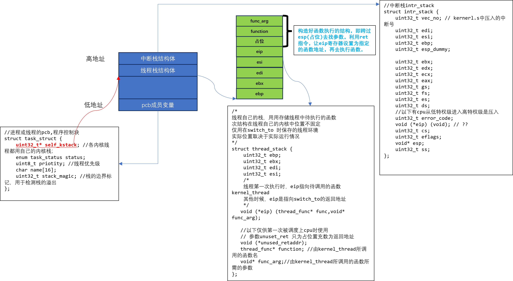
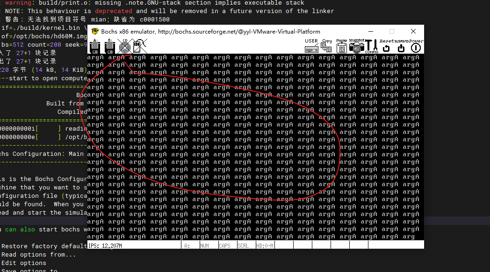

调用函数是让所运行的函数能够以调度单元的身份独立上处理器运行，当函数可以独立运行时，就会有更大的好处，那就是可以让程序中的多个函数（执行流）以并行的方式运行

线程是什么？具有能动性、执行力、独立的代码块。进程是什么？进程=线程+资源。根据进程内线程的数量，进程可分为。
（1）单线程进程：如果厨房中只有一个工作人员，即配菜、炒菜、洗涮厨具等这几样工作都是一个人做，那么厨房的工作效率必然会很低，因为此时厨房中就一个线程。
（2）多线程进程：厨房人手多了，工作才更高效，因此为配菜、炒菜、洗涮厨具专门配备了 3 个工作人员，也就是说进程内的线程多了。


执行流、调度单位、运行实体等概念都是针对线程而言的，线程才是解决问题的思路、步骤，它是具有能动性的指令，因此只有它才能上处理器运行，即一切执行流其实都是线程，因为任何时候进程中都至少存在一个线程。进程独自拥有整个地址空间，在这个空间中装有线程运行所需的资源，所以地址空间相当于资源容器，就像鱼缸为鱼提供了水。因此，进程与线程的关系是进程是资源容器，线程是资源使用者。进程与线程的区别是线程没有自己独享的资源，因此没有自己的地址空间，它要依附在进程的地址空间中从而借助进程的资源运行。说白了就是线程没有自己的页表，而进程有.

- struct intr_stack 定义了程序的中断栈，无论是进程，还是线程，此结构用于中断发生时保护程序的上下文环境。也就是说，进入中断后，在 kernel.S 中的中断入口程序“intr%1entry”所执行的上下文保护的一系列压栈操作都是压入了此结构中。因此，进程或线程被外部中断或软中断打断时，中断入口程序会按照此结构压入上下文寄存器，所以，kernel.S 中 intr_exit 中的出栈操作便是此结构的逆操作。初始情况下此栈在线程自己的内核栈中位置固定，在 PCB 所在页的最顶端，每次进入中断时就不一定了，如果进入中断时不涉及到特权级变化，它的位置就会在当前的 esp 之下，否则处理器会从 TSS 中获得新的esp 的值，然后该栈在新的 esp 之下

- ABI 规定的是更加底层的一套规则，属于编译方面的约定，比如参数如何传递，返回值如何存储，系统调用的实现方式，目标文件格式或数据类型等。只要操作系统和应用程序都遵守同一套 ABI 规则，编译好的应用程序可以无需修改直接在另一套操作系统上运行
    -   规则其中的一条就是，主调函数调用被调函数，被调函数一定要保存ebp、ebx、edi、esi、esp。只要都遵守这个规则，应用程序就可以在任何操作系统上运行

- 在 thread_create 中，pthread->self_kstack -= sizeof（struct intr_stack）是为了预留线程所使用的中断栈
struct intr_stack 的空间，这有两个目的。
（1）将来线程进入中断后，位于 kernel.S 中的中断代码会通过此栈来保存上下文。
（2）将来实现用户进程时，会将用户进程的初始信息放在中断栈中

- 开启线程：
```
    asm volatile("movl %0,%%esp;pop %%ebp;pop %%ebx;pop %%edi;pop %%esi;ret": : "g"(thread->self_kstack):"memory");
```
  - 在输出部分，"g" (thread->self_kstack)使 thread->self_kstack 的值作为输入，采用通用约束 g，即内存或寄存器都可以
  - 在汇编语句部分， movl %0, %%esp ，也就是使 thread->self_kstack 的值作为栈顶，此时thread->self_kstack 指向线程栈的最低处，这是我们在函数 thread_create 中设定的。
  - 接下来的这连续 4 个弹栈操作：pop %%ebp; pop %%ebx; pop %%edi; pop %%esi 使之前初始化的 0 弹入到相应寄存器中。
  - 此时栈顶的数据是在 thread_create 中为 kthread_stack->eip 所赋的值—kernel_thread。ret 会把栈顶的数据作为返回地址送上处理器的EIP 寄存器。因此，在执行 ret 后，当ret弹出eip后，esp指向的是无意义的占位符，处理器会去执行 kernel_thread 函数。接着在 kernel_thread 函数中会调用传给函数 function(func_arg)。

- **创建一个线程，就是分配一页内存，设置pcb信息块，初始化好线程栈，保存好寄存器，构造出函数调用的约定栈参数布局，让esp寄存器指向栈顶，利用ret让eip设置为待执行函数的地址，cpu去地址执行函数**
    
- 运行结果：
  