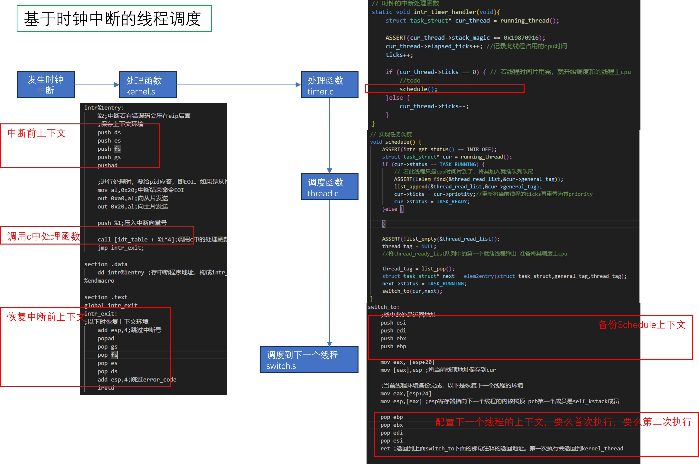
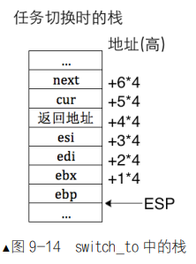

- 函数 running_thread，它的功能是返回线程的 PCB 地址。原理很简单，各个线程所用的 0 级栈都是在自己的 PCB 当中，因此取当前栈指针的高 20 位作为当前运行线程的 PCB

- kernel_thread 函数有了很重要的变化，在函数体中增加了开中断的函数 intr_enable，它是任务调度的保证。原因是我们的**任务调度机制基于时钟中断**，由时钟中断这种“不可抗力”来中断所有任务的执行，借此将控制权交到内核手中，由内核的任务调度器 schedule（后面有小节专门论述 schedule）考虑将处理器使用权发放到某个任务的手中，下次中断再发生时，权利将再被回收，周而复始，这样便保证操作系统不会被“架空”，而且保证所有任务都有运行的机会。线程的首次运行是由时钟中断处理函数调用任务调度器 schedule 完成的，进入中断后处理器会自动关中断，因此在执行 function 前要打开中断，否则 kernel_thread 中的 function 在关中断的情况下运行，也就是时钟中断被屏蔽了，再也不会调度到新的线程，function 会独享处理器。
- 其实我们从开机到创建第一个线程前，程序都有个执行流，这个执行流带我们从 BIOS 到 mbr 到 loader 到 kernel，其实它就是我们所说的主线程。为此我们还在 loader 中把 esp 置为 0xc009f000，这是有意为之的设计，意图是把 0xc009e000 作为主线的 PCB。现在我们要创建新线程了，并且打开了时钟中断，时钟中断的处理函数会判断当前线程所用的栈是否会破坏了线程信息，也就是判断 thread->stack_magic 是否等于 0x19870916。可是新创建的线程在首次运行前一直是主线程在跑，但此时主线程还没有身证，也就是还没有 PCB，因此 main_thread->stack_magic 就是错误的值，所以我们提前调用 make_main_thread 函数为主线程赋予了 PCB
- ticks 赋值为 prio，优先级越高，ticks 越大。每发生一次时钟中断，时钟中断的处理程序便将当前运行
线程的 ticks 减 1。当 ticks 为 0 时，时钟的中断处理程序调用调度器 schedule，也就是该把当前线程换下
处理器了，让调度器选择另一个线程上处理器

- 完整的调度过程需要三部分的配合。
（1）时钟中断处理函数。
（2）调度器 schedule。
（3）任务切换函数 switch_to。

- Pagefault 就是通常所说的缺页异常，它表示虚拟地址对应的物理地址不存在，也就是虚拟地址尚未在页表中分配物理页，这样会导致 Pagefault 异常。
- 保护好任务两层执行流的上下文
  - 第一部分是进入中断时的保护，这保存的是任务的全部寄存器映像，也就是进入中断前任务所属第一层的状态，这些寄存器映像相当于任务中用户代码的上下文.上下文保护的第一部分负责保存任务进入中断前的全部寄存器，目的是能让任务恢复到中断前
```
intr%1entry:
    %2;中断若有错误码会压在eip后面
    ;保存上下文环境
    push ds
    push es
    push fs
    push gs
    pushad

    ;进行处理时，要给pid应答，即EOI。如果是从片上进入中断；处理往从片上发送EOI外，还要往主片发送EOI
    mov al,0x20;中断结束命令EOI
    out 0xa0,al;向从片发送
    out 0x20,al;向主片发送

    push %1;压入中断向量号

    call [idt_table + %1*4];调用c中的处理函数
    jmp intr_exit;

section .data
    dd intr%1entry ;存中断程序地址，构成intr_entry_table数组，连续分布
%endmacro

section .text
global intr_exit
intr_exit:
;以下时恢复上下文环境
    add esp,4;跳过中断号
    popad
    pop gs
    pop fs
    pop es
    pop ds
    add esp,4;跳过error_code
    iretd
```
  - 上下文保护的第二部分负责保存这 4 个寄存器：esi、edi、ebx 和 ebp，目的是让任务恢复执行在任务切换发生时剩下尚未执行的内核代码，保证顺利走到退出中断的出口，利用第一部分保护的寄存器环境彻底恢复任务




- switch_to的栈
如果此时的 next 线程之前尚未执行过，马上开始的是第一次执行，此时栈顶的值是函数 kernel_thread的地址，这是由 thread_create 函数设置的，执行 ret 指令后处理器将去执行函数 kernel_thread。如果 next之前已经执行过了，这次是再次将其调度到处理器的话，此时栈顶的值是由调用函数 switch_to 的主调函数 schedule 留下的，这会继续执行 schedule 后面的流程。而 switch_to 是 schedule 最后一句代码，因此执行流程马上回到 schedule 的调用者 intr_timer_handler 中。schedule 同样也是 intr_timer_handler 中最后一句代码，因此会完成 intr_timer_handler，回到 kernel.S 中的 jmp intr_exit，从而恢复任务的全部寄存器映像，之后通过 iretd 指令退出中断，任务被完全彻底地恢复。switch_to 到这就结束了，它略微有些难懂，这主要体现在。


- 编译错误：
  -  storage class specified for parameter：应该extern只声明不定义
