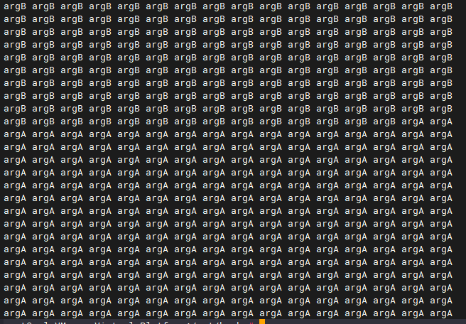

- 信号量
增加操作 up 包括两个微操作。
（1）将信号量的值加 1。
（2）唤醒在此信号量上等待的线程。
减少操作 down 包括三个子操作。
（1）判断信号量是否大于 0。
（2）若信号量大于 0，则将信号量减 1。
（3）若信号量等于 0，当前线程将自己阻塞，以在此信号量上等待。
信号量是个全局共享变量，up 和 down 又都是读写这个全局变量的操作，而且它们都包含一系列的子操作，因此它们必须都是原子操作。信号量的初值代表是信号资源的累积量，也就是剩余量，若初值为 1 的话，它的取值就只能为 0 和 1，这便称为二元信号量，我们可以利用二元信号量来实现锁。在二元信号量中，down 操作就是获得锁，up 操作就是释放锁。我们可以让线程通过锁进入临界区，可以借此保证只有一个线程可以进入临界区，从而做到互斥。大致流程为：y 线程 A 进入临界区前先通过 down 操作获得锁（我们有强制通过锁进入临界区的手段），此时信号量的值便为 0。y 后续线程 B 再进入临界区时也通过 down 操作获得锁，由于信号量为 0，线程 B 便在此信号量上
等待，也就是相当于线程 B 进入了睡眠态。y 当线程 A 从临界区出来后执行 up 操作释放锁，此时信号量的值重新变成 1，之后线程 A 将线程 B唤醒。y 线程 B 醒来后获得了锁，进入临界区。

- 阻塞线程，把当前线程的状态设置成不可运行，就不可被调度了。然后再调度执行其他线程。

- 就目前代码而言，换上cpu的线程之前为什么在就绪队列只有三种可能，一种就是时间片没了，时钟中断导致运行态变成就绪态；第二种就是被thread_unblock唤醒到就绪队列，由阻塞态变为就绪态。第三种是创建的新线程，还从未上过处理器，初始就是就绪态。
第一种要从之前的时钟中断处理程序返回到原函数，中断处理程序结束时的iret指令会开中断，
第二种就要依靠intr_set_status(old_status);这句代码手动开中断了，
第三种是新线程第一次上处理器前会执行kernem_thread，再由kernem_thread去执行新线程初始函数function，其中kernem_thread中会先开中断再调用初始函数function
同时，目前能够执行调度函数schedule的代码只有两个位置，一个位置是时钟中断处理函数发现时间片用完了会将当前线程由运行态变为就绪态再调度新线程，
第二位置就是上述代码，无需中断，线程主动将自己的运行态变成阻塞态后再调用schedule，比如消费者请求从键盘缓冲区消费一个字符并打印在显示器上，如果此时环形键盘缓冲区为空，该线程就要主动阻塞自己。或者本实验的互斥访问显示器打印字符也会涉及阻塞自己、还有硬盘驱动程序中读写磁盘的时候，也会主动阻塞自己，当磁盘完成读写命令后会发出外部中断，这个硬盘中断处理程序会再次唤醒该线程或进程。
所以综上调用schedule并不一定要中断，但是一定要关中断保证shcedule一套的原子性，所以各种情况的原子性代码执行完毕后对应的开中断已在上述列出。

注意一个问题，在调用schedule前，显然一定要关中断。
本次实验一共两种情况会调用scheduel，一种是时间片为0时，时钟中断处理函数，这个时候中断隐指令关中断；另一种是P操作里的block会调用scheduel，P操作第一句就是关中断。

timer.c里的时钟中断处理函数在判断时间片用完后也调用了schedule,但并没有关中断，这是因为中断过程中，执行中断处理程序前，已经自动完成了关中断。

注意：本次实验模拟的中断都是单重中断，所以中断隐指令时会关中断，中断服务程序结束后，才会打开。
如果是允许多重嵌套中断，中断服务处理程序会在开中断下执行，所以在所有中断处理程序调用schduel前，都要关中断，因为scheduel涉及到公共资源管理线程状态队列的修改。

