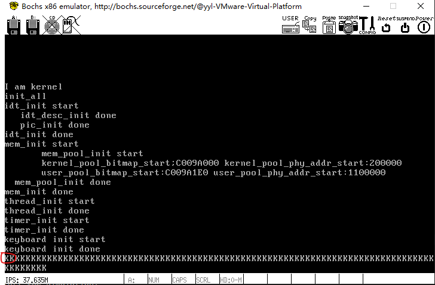
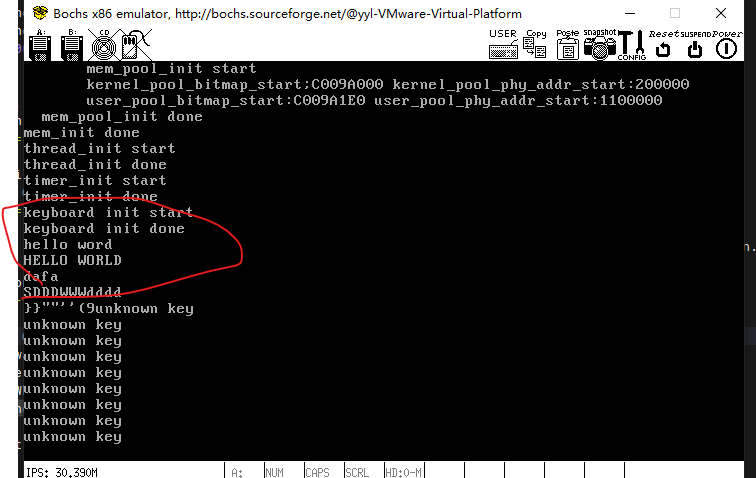

- 键盘输入，要对8042键盘代理芯片编程，用in out指令操作
  
键盘按下会触发通码 和 断码

本次实验没有处理F1到F12，也没有处理小键盘区按键
只有通码为01到3A的处理
其中，除了CapsLock、Shift、Ctrl，其余的键的断码都没有必要处理，因为他们的通码优先处理了。
CapsLock、Shift、Ctrl检测到是断码，那么转化成通码统一判断

实现效果，可以输入
