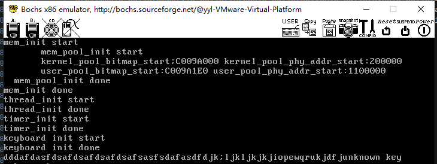

- 环形缓冲区

咱们从上往下说，ioqueue_init 函数接受一个缓冲区参数 ioq，用于初始化缓冲区 ioq。此函数负责三样工
作，先通过初始化 io 队列的锁，再将生产者和消费者置为 NULL，最后再将缓冲区的队头和队尾置为下标 0。
next_pos 函数接受一个参数 pos，功能是返回 pos 在缓冲区中的下一个位置值，它是将 pos+1 后再对
bufsize 求模得到的，这保证了缓冲区指针回绕着数组 buf，从而实现了环形缓冲区。
ioq_full 函数接受一个缓冲区参数 ioq。功能是返回队列是否已满，若已满则返回 true，否则返回 false。
原理是“next_pos(ioq->head) == ioq->tail”，判断下一个队首位置是否和队尾位置相等，即是否会碰撞。从
这一点看出，虽然缓冲区大小 bufsize 是 64 字节，但其最大容量为 63 字节。
ioq_empty 函数接受一个缓冲区参数 ioq。功能是返回队列是否为空，若空则返回 true。原理是判断
ioq->head 是否等于 ioq->tail，若头尾相等则为空。
ioq_wait 函数接受一个参数 waiter，它是 pcb 类型的二级指针，因此传给它的实参将是线程指针的地
址，函数功能是使当前线程睡眠，并在缓冲区中等待。估计大伙儿都猜到了，传给 waiter 的实参一定是缓
冲区中的成员 producer 或 consumer。在函数体内就做了两件事，将当前线程记录在 waiter 指向的指针中，
也就是缓冲区中的 producer 或 consumer，因此*waiter 相当于 ioq->consumer 或 ioq->producer。随后调用
“thread_block(TASK_BLOCKED)”将当前线程阻塞。
wakeup 函数接受一个参数 waiter，它同样也是 pcb 类型的二级指针，因此传给它的实参也是缓冲区中
的成员 producer 或 consumer。函数功能就是通过“thread_unblock(*waiter)”唤醒*waiter（生产者或消费
者），随后将*waiter 置空。
咱们对缓冲区操作的数据单位大小是 1 字节，即生产者每次往缓冲区中放一字节数据，消费者每次从缓冲区中取一字节数据。
ioq_getchar 函数接受一个缓冲区参数 ioq，函数功能是从 ioq 的队尾处返回一个字节，这属于从缓冲
区中取数据，因此 ioq_getchar 是由消费者线程调用的。
函数体中，先通过“while(ioq_empty(ioq))”循环判断缓冲区 ioq 是否为空，如果为空就表示没有数据
可取，只好先在此缓冲区上睡眠，直到有生产者将数据添加到此缓冲区后再被叫醒重新取数据。但是你懂
的，消费者有可能有多个，它们之间是竞争的关系，醒来后有可能别的消费者刚刚把缓冲区中的数据取走
了，因此在当前消费者被叫醒后还要再判断缓冲区是否为空才比较保险，所以用 while 循环来重复判断。
while 循环体中先通过“lock_acquire(&ioq->lock)”申请缓冲区的锁，持有锁后，通过“ioq_ wait(&ioq-> 
consumer)”将自己阻塞，也就是在此缓冲区上休眠。您看，这里传给 ioq_wait 的实参就是缓冲区的消费
者&ioq->consumer，此项用来记录哪个消费者没有拿到数据而休眠。这样等将来某个生产者往缓冲区中添
加数据的时候就知道叫醒它继续拿数据了。醒来后执行“lock_release(&ioq->lock)”释放锁。
在 while 循环判断中，如果缓冲区不为空的话，通过代码“byte = ioq->buf[ioq->tail]”从缓冲区队尾获
取 1 字节的数据，接着通过“ioq->tail = next_pos(ioq->tail)”将队尾更新为下一个位置。
在消费者读取了一个字节后，缓冲区就腾出一个数据单位的空间了，这时候要判断一下是否有生产者
在此缓冲区上休眠。若之前此缓冲区是满的，正好有生产者来添加数据，那个生产者一定会在此缓冲区上
睡眠。因此要判断 ioq->producer 是否不等于 NULL，如果不等于 NULL，这说明之前有生产者线程在调用
函数 ioq_putchar（生产者往添加缓冲区中添加数据的方法，后面马上介绍）往缓冲区中添加数据时因为缓冲区
满而休眠了，既然现在缓冲区已被当前消费者线程腾出一个数据单位的空间了，此时应该叫醒生产者继续往缓
冲区中添加数据。因此调用“wakeup(&ioq->producer)”唤醒生产者。之后通过 return byte 返回获取数据。
ioq_putchar 函数接受两个参数，一个是缓冲区参数 ioq，另一个是待加入字节数据 byte，函数功能是
往缓冲区 ioq 中添加 byte，这是由生产者线程调用的。
在函数体中也是先通过 while 循环判断缓冲区 ioq 是否为满，如果满了的话，先申请缓冲区的锁
ioq->lock，然后通过调用“ioq_wait(&ioq->producer)”将自己阻塞并登记在缓冲区 ioq 的成员 producer 中，
这样消费者便知道唤醒哪个生产者了。随后释放锁。
如果缓冲区不满的话，通过“ioq->buf[ioq->head] = byte”，将数据 byte 写入缓冲区的队首 ioq->head。
随后通过“ioq->head = next_pos(ioq->head)”将队首更新为下一位置。
这里依然要判断是否有消费者在此缓冲区上休眠。若之前此缓冲区为空，恰好有消费者来取数据，因此
会导致消费者休眠。现在当前生产者线程已经往缓冲区中添加了数据，现在可以将消费者唤醒让它继续取数
据了。如果 ioq->consumer 不等于 NULL，这说明之前已经有消费者线程因为缓冲区空而休眠，被登记在
ioq->consumer，因此调用“wakeup(&ioq->consumer)”将消费者唤醒

- 运行效果：
