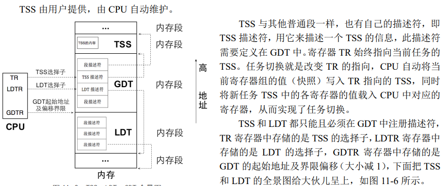

- TSS


TSS 是 CPU 原生支持的数据结构，因此 CPU 能够直接、正确识别其中的所有字段。当任务被换下CPU时，CPU 会自动将当前寄存器中的值存储到 TSS 中的对应位置，当有新任务上 CPU 运行时，CPU会自动从新任务的 TSS 中找到相应的寄存器值加载到对应的寄存器中。



我们使用 TSS 唯一的理由是为 0 特权级的任务提供栈。

Linux一次性加载TSS和TR，初始化0特权级栈，然后不断修改同一个TSS的内容。
这次试验应该只是在一个任务特权级切换的时候，使用了TSS的0特权级栈，任务切换都是在同一个TSS修改，这样相比原生效率大大提升。


描述符大小都是 8 字节，在 GDT 中第 0 个段描述符不可用，第 1 个为代码段，第 2 个为数据段和栈，第 3 个为显存段，因此把 tss 放到第 4 个位置，也就是 0xc0000900+0x20 的位置。

在现有线程的基础上实现进程。给线程装备上虚拟地址池和管理位图。


进程与线程的区别是进程拥有独立的地址空间，不同的地址空间就是不同的页表，因此我们在创建进程的过程中需要为每个进程单独创建一个页表
- 要为每个进程单独申请存储页目录项及页表项的虚拟内存页
- 还得为进程分配内存（虚拟内存）作为 3 级栈空间

得在特权级 0 的环境中，其次是执行 iretd 指令
- 从中断返回，必须要经过 intr_exit，即使是“假装
- 必须提前准备好用户进程所用的栈结构，在里面填装好用户进程的上下文信息，借一系列 pop 出栈的机会，将用户进程的上下文信息载入 CPU 的寄存器，为用户进程的运行准备好环境
- 我们要在栈中存储的 CS 选择子，其 RPL必须为 3
- 栈中段寄存器的选择子必须指向 DPL 为 3 的内存段
- 必须使栈中 eflags 的 IF 位为 1。
- 必须使栈中 eflags 的 IOPL 位为 0


进程执行过程：


用户进程在执行前，是由操作系统的程序加载器将用户程序从文件系统读到内存，再根据程序文件的格式解析其内容，将程序中的段展开到相应的内存地址。程序格式中会记录程序的入口地址，CPU 把 CS:[E]IP 指向它，该程序就被执行了

struct intr_stack 栈用来存储进入中断时任务的上下文，struct thread_stack 用来存储在中断处理程序中、任务切换（switch_to）前后的上下文


通过内联汇编，将栈 esp 替换为我们刚刚填充好的 proc_stack，然后通过 jmp intr_exit 使程序流程跳转到中断出口地址 intr_exit，通过那里的一系列 pop 指令和 iretd 指令，将 proc_stack 中的数据载入CPU 的寄存器，从而使程序“假装”退出中断，进入特权级 3

```
asm volatile ("movl %0, %%esp; jmp intr_exit" : : "g" (proc_stack) : "memory");
```

每个进程都拥有独立的虚拟地址空间，本质上就是各个进程都有单独的页表，页表是存储在页表寄存器 CR3中的，CR3 寄存器只有 1 个，因此，不同的进程在执行前，我们要在 CR3 寄存器中为其换上与之配套的页表，从而实现了虚拟地址空间的隔离


C 程序大体上分为预处理、编译、汇编和链接四个阶段。根据语法规则，编译器会在汇编阶段将汇编程序源码中的关键字 section 或 segment（汇编源码中，通常用语法关键字 section 或 segment来逻辑地划分程序区域，虽然很多书中都称此程序区域为段，但实际上它们就是节 section。注意啦，这里所说的 segment 和 section 是指汇编语法中的关键字，仅指它们在汇编代码中的语法意义相同，并不是指编译、链接中的 section 和 segment）编译成节，也就是之前介绍的 section，此时只是生成了目标文件，目标文件中的这些节还不是程序空间中的独立的代码段或数据段，或者说仅仅是代码段或数据段的一部分。链接器将这些目标文件中属性相同的节（section）合并成段（segment），因此一个段是由多个节组成的，我们平时所说的 C 程序内存空间中的数据段、代码段就是指合并后的 segment。

（1）可读写的数据，如数据节.data 和未初始化节.bss。
（2）只读可执行的代码，如代码节.text 和初始化代码节.init。
（3）只读数据，如只读数据节.rodata，一般情况下字符串就存储在此节。

bss 的作用就是为程序运行过程中使用的未初始化数据变量提前预留了内存空间。程序的 bss 段（数据段的一部分）会由该加载器填充为 0


- 构造进程
  - 创建虚拟位图
  - 创建独立的页表，拷贝内核页表项
  - 设置3权级，用户进程的gtd描述符


运行效果：


查看用户进程，在3特权级下：


