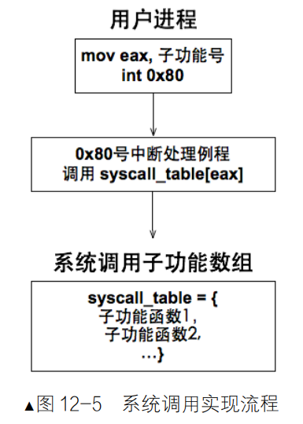
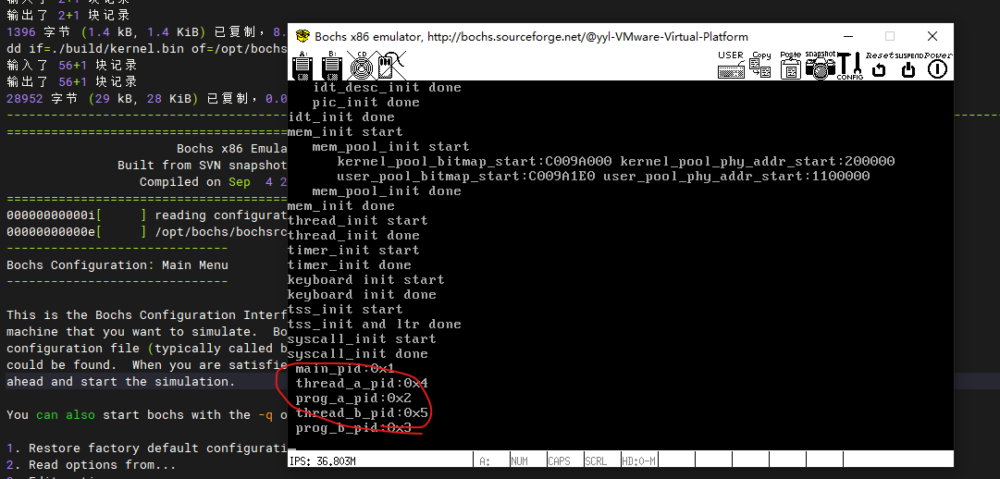

#### 完善内核，实现获取进程pid系统调用
- 实现系统调用思路：
  - 用中断门实现系统调用，效仿 Linux 用 0x80 号中断作为系统调用的入口
  - 在 IDT 中安装 0x80 号中断对应的描述符，在该描述符中注册系统调用对应的中断处理例程
  - 建立系统调用子功能表 syscall_table，利用 eax 寄存器中的子功能号在该表中索引相应的处理函数
  - 用宏实现用户空间系统调用接口_syscall，最大支持 3 个参数的系统调用，故只需要完成_syscall[0-3]。寄存器传递参数，eax 为子功能号，ebx保存第 1 个参数，ecx 保存第 2 个参数，edx 保存第 3 个参数

运行效果：

