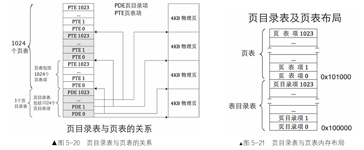
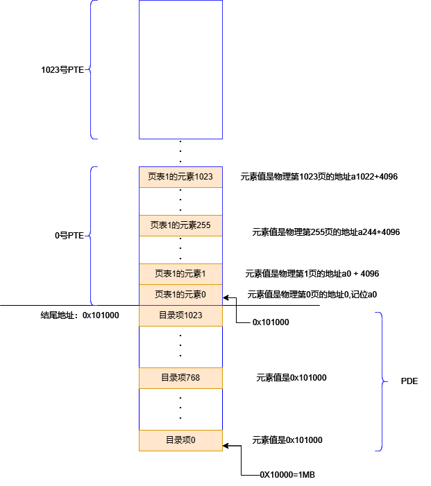
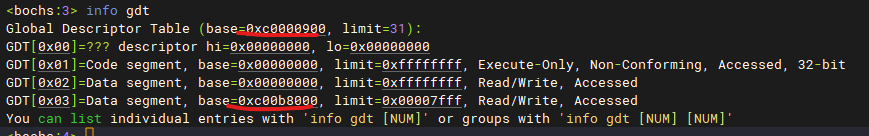

####  二级页表
  - 内存被分为页,以页位单位管理物理内存，一页的大小是4KB，12位
  - 页表的表，即页表的目录表，一片内存，有1024块，每块4Byte，32位够表示一个地址,该表占用4KB内存，恰好是一页。每个元素存的是一个地址，就是一个页表的物理地址。PDE
  - 页表，一片内存，有1024块，每块4Byte,也占一页大小。每个元素就是一个物理地址。PTE
  - 地址转换：
      - 32地址分为高10位，中10位，低12位。
      - 高10位表示目录表的索引a，也就是第几个页表。
      - 中10位表示页表的索引b，也就是第几个表项。
      - 低12位刚好能表达页偏移c。
      - 因为PDE每一项大小是4Byte，所以索引值乘以4才是对应页表的地址
      - 同理，PTE索引值乘以4才是对应页表项目的地址
      - 最终物理地址= [[base + a * 4] + b * 4] + c
        - base是PDE地址
        - 其中[]指的是从对应的地址读取存储的数据
        - base + a * 4表示PDE第a个元素的地址
        - [base + a * 4]表示读取PDE第a个元素存储的值，是个地址，是页表的地址
        - [base + a * 4] + b * 4 是页表的地址
        - [[base + a * 4] + b * 4]读取页表PTE第b个元素值，是个地址，是物理地址
        - [[base + a * 4] + b * 4] + c 最后再加上页内偏移量
- 页表目录表和页表的内存布局设计：
  - 进制转换：PDE大小是4KB，4 * 1024 = 2 ^ 12 = 16 ^ 3，0x1000

    

- 为什么一个页表能表示4MB的内存容量？
  - 一个页表是一个数组，有1024个元素，每个元素指向一个物理页的起始地址，而物理页的大小就是4KB，所以一个页表能表达1023 * 4KB=4MB大小的内存容量
- 为什么要 10 10 12 划分地址？
  - 高10，10位二进制能排列组合1024个数字
  - 中10，能组合1024个数字
  - 低12位，能组合出4K个数字，即4KB个数字，4KB个地址
  - 1024 * 1024 * 4KB = 4GB 能表达处4GB内存
  - 所以一个32位地址，和(a,b,c)映射
- 物理页块首地址：是4KB的倍数，即0x1000,也就是说低12位为0，则页目录项和页表项的低12位可以用来表达其他属性

- 内存布局设计：
  - 将虚拟地址3G~3G+1M 映射到 物理地址0~1M
  - 将虚拟地址0~1M 映射到 物理地址0~1M
  - 将物理地址0~1M 映射到 物理地址0~1M
  - 完成mbr loader内核都位于0~1M，页目录首地址是0x100000
  - 3G = 3 * 1024 MB = 3 * 1024 * 1024KB = 3 * 1024 * 1024 * 1024Byte=3 * 2 ^30 = 3*(16^7 * 2^2) = 3 * 16^7 * 4=12*16^7=0xc0000 000
  
  

  - 运行结果：
  
  

  gdt 首地址变成虚拟地址 显存段基址也变成了虚拟地址 高3G处

  