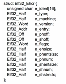
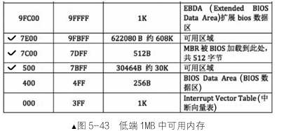
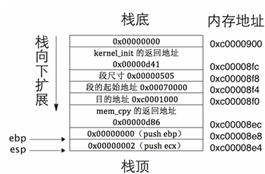
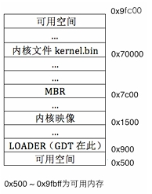
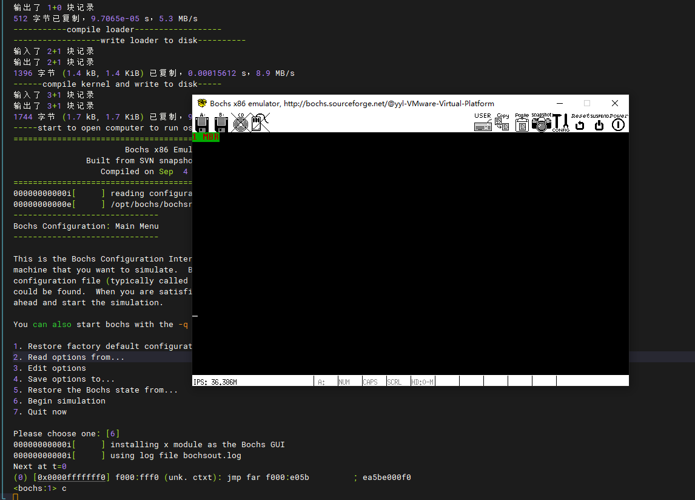

#### ubuntu24 降级gcc版本到4.4
- 添加源:/etc/apt/sources.list.d/ubuntu.sources
```
Types: deb
URIs: http://dk.archive.ubuntu.com/ubuntu/
Suites: noble-security
Components: xenial main restricted universe multiverse
Signed-By: /usr/share/keyrings/ubuntu-archive-keyring.gpg

Types: deb
URIs: http://dk.archive.ubuntu.com/ubuntu/
Suites: noble-security
Components: xenial main restricted universe multiverse
Signed-By: /usr/share/keyrings/ubuntu-archive-keyring.gpg
```


- 升级源:sudo apt update
  - 报错：
  W: GPG 错误：http://dk.archive.ubuntu.com/ubuntu trusty-updates InRelease: 由于没有公钥，无法验证下列签名： NO_PUBKEY 40976EAF437D05B5 NO_PUBKEY 3B4FE6ACC0B21F32
  - 解决：
    - sudo apt-key adv --keyserver keyserver.ubuntu.com --recv-keys 40976EAF437D05B5
    - sudo apt-key adv --keyserver keyserver.ubuntu.com --recv-keys 3B4FE6ACC0B21F32
- 安装gcc4.4:sudo apt-get install gcc-4.4
- 设置优先级：sudo update-alternatives  --install /usr/bin/gcc gcc /usr/bin/gcc-4.4 1


gcc -c -o /opt/bin/main.o /opt/os/version5/kernel/main.c && ld main.o -Ttext 0xc0001500 -e main -o /opt/bin/kernel.bin

- 可重定位文件：包含了elf头和节头表，为链接准备
- 可执行文件：包含elf头和程序头表，链接过程就把多个节合并成一个段
  - elf头记录了程序头表的信息
  - 程序头表是记录了程序段的信息列表
  - elf头+程序头表+main函数

  #### elf header:
  
    
    
  - 遍历程序头表：
    - e_phentsize:程序头表表项的大小，在elf header后42字节处
    - e_phoff，第一个程序头表在文件中偏移量，在elf header后28字节处
    - e_phnum，程序头表表项的个数，在elf header后44字节处
  - 程序头表项：
    - p_type，类型，PT_NULL是跳过该段
    - p_filesz，指明本段在文件中的大小
    - p_offset，本段相对于文件起始的偏移量
    - p_vaddr，段要被拷贝到那个地址上，将来好让cpu执行
#### 加载内核
  - 将bin文件从磁盘拷贝到物理地址某个地方，低端内存可用内存出
  - 
    

    取整，使用0x70000.内核不超过100kb

    选择0x1500作为内核映像入口地址
  - **一句话，将内核可执行文件加载到物理地址0x70000处，解析它的头，将段再拷贝到对应的地址上，loader跳转到内核入口处执行**
  - mem_cpy调用栈:
    

```
; ----mem_cpy 内存拷贝---
mem_cpy:
  cld ;清楚内存拷贝操作方向
  push ebp
  mov ebp,esp
  push ecx ;rep指令使用了ecx，先备份调用前的值，避免影响外层
  mov edi,[ebp + 8]
  mov esi,[ebp + 12]
  mov ecx,[ebp + 16]
  rep movsb ;一个字一个字拷贝

  ;恢复调用前状态
  pop ecx
  pop ebp
  ret
```
  - 内存布局：
  - 
    


  - 运行结果:
    
  
  