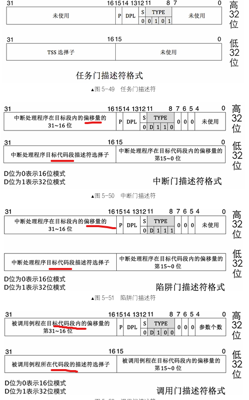

#### ubuntu24 降级gcc版本到4.4
- 添加源:/etc/apt/sources.list.d/ubuntu.sources
```
Types: deb
URIs: http://dk.archive.ubuntu.com/ubuntu/
Suites: noble-security
Components: xenial main restricted universe multiverse
Signed-By: /usr/share/keyrings/ubuntu-archive-keyring.gpg

Types: deb
URIs: http://dk.archive.ubuntu.com/ubuntu/
Suites: noble-security
Components: xenial main restricted universe multiverse
Signed-By: /usr/share/keyrings/ubuntu-archive-keyring.gpg
```


- 升级源:sudo apt update
  - 报错：
  W: GPG 错误：http://dk.archive.ubuntu.com/ubuntu trusty-updates InRelease: 由于没有公钥，无法验证下列签名： NO_PUBKEY 40976EAF437D05B5 NO_PUBKEY 3B4FE6ACC0B21F32
  - 解决：
    - sudo apt-key adv --keyserver keyserver.ubuntu.com --recv-keys 40976EAF437D05B5
    - sudo apt-key adv --keyserver keyserver.ubuntu.com --recv-keys 3B4FE6ACC0B21F32
- 安装gcc4.4:sudo apt-get install gcc-4.4
- 设置优先级：sudo update-alternatives  --install /usr/bin/gcc gcc /usr/bin/gcc-4.4 1


gcc -c -o /opt/bin/main.o /opt/os/version5/kernel/main.c && ld main.o -Ttext 0xc0001500 -e main -o /opt/bin/kernel.bin

- 可重定位文件：包含了elf头和节头表，为链接准备
- 可执行文件：包含elf头和程序头表，链接过程就把多个节合并成一个段
  - elf头记录了程序头表的信息
  - 程序头表是记录了程序段的信息列表
  - elf头+程序头表+main函数

  #### elf header:
  
    
    
  - 遍历程序头表：
    - e_phentsize:程序头表表项的大小，在elf header后42字节处
    - e_phoff，第一个程序头表在文件中偏移量，在elf header后28字节处
    - e_phnum，程序头表表项的个数，在elf header后44字节处
  - 程序头表项：
    - p_type，类型，PT_NULL是跳过该段
    - p_filesz，指明本段在文件中的大小
    - p_offset，本段相对于文件起始的偏移量
    - p_vaddr，段要被拷贝到那个地址上，将来好让cpu执行
#### 加载内核
  - 将bin文件从磁盘拷贝到物理地址某个地方，低端内存可用内存出
  - 
    

    取整，使用0x70000.内核不超过100kb

    选择0x1500作为内核映像入口地址
  - **一句话，将内核可执行文件加载到物理地址0x70000处，解析它的头，将段再拷贝到对应的地址上，loader跳转到内核入口处执行**
  - mem_cpy调用栈:
    

```
; ----mem_cpy 内存拷贝---
mem_cpy:
  cld ;清楚内存拷贝操作方向
  push ebp
  mov ebp,esp
  push ecx ;rep指令使用了ecx，先备份调用前的值，避免影响外层
  mov edi,[ebp + 8]
  mov esi,[ebp + 12]
  mov ecx,[ebp + 16]
  rep movsb ;一个字一个字拷贝

  ;恢复调用前状态
  pop ecx
  pop ebp
  ret
```
  - 内存布局：
  - 
    


  - 运行结果:
    


#### 特权级
指令放在代码中，代码段寄存器cs放段选择子，选择子低两位RPL表示代码请求资源能力的等级CPL


段描述符有DPL字段，表达段的权级

段选择子有RPL字段，低2位表示请求权级
#### 门
一块内存数据结构，描述一段特殊程序的信息，说明这段程序地址在哪。



任务门描述符可以放在GDT、LDT和IDT。调用门可以位于GDT、LDT中，中断门和陷阱门仅位于IDT中。

- 调用门：
call 和jmp 指令后接调用门选择子为参数，以调用函数例程的形式实现从低特权向高特权转移，可用来实现系统调用。call指令使用调用门可以实现向高特权代码转移，jmp指令使用调用门只能实现向平级代码转移。用户调用内核，如何特权级需要提升，则要使用高特权级栈，往里压入用户的栈段选择子SS、用户的栈顶ESP、用户参数、用户代码段寄存器CS、用户指令寄存器EIP，返回是用于回到用户状态。s
- 中断门：
以int 指令主动发中断的形式实现从低特权向高特权转移
- 任务门：
任务以任务状态段 TSS 为单位，用来实现任务切换，它可以借助中断或指令发起。当中断发生时，如果对应的中断向量号是任务门，则会发起任务切换。也可以像调用门那样，用call或jmp指令后接任务门的选择子或任务TSS的选择子。
- 用户程序想要获取物理内存大小，该数据存储在loader的数据段中。
  - call 调用门选择子，该门描述符DPL是3，为了让用户程序能用。该门选择子RPL是3
  - 用户程序的CPL RPL是3，调用门时，满足CPL<=DPL,RPL<=DPL，检查通过
  - 假设调用门指向的程序为X,则X_DPL是0，因为他是内核程序。再次检查，用户程序CPL>=X_DPL,通过，可以使用该调用门
  - 处理器把CPL设置0内核特权级，记录在CS.RPL中。
  - X参数是用户提交的结果缓冲区段选择子和偏移量，避免缓冲区指向内核，将用户程序提交的选择子设置为用户程序的CPL，即3
  - 处理器固件将用户提交参数复制到0级栈
    - 用户正常提交的缓冲区参数指向用户区，则内核将要访问的段DPL是3，满足CPL<=DPL,RPL<=DPL，0<=3,3<=
    - 用户搞破坏，缓冲区段指向内核，则目标段DPL是0，不满足CPL<=DPL,RPL<=DPL，0<=0,3<=0，抛出异常
  
  