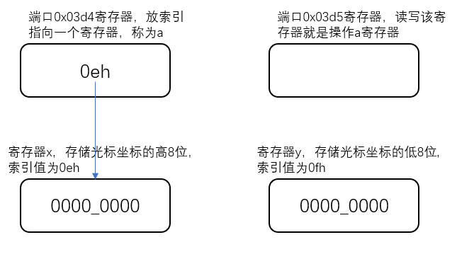
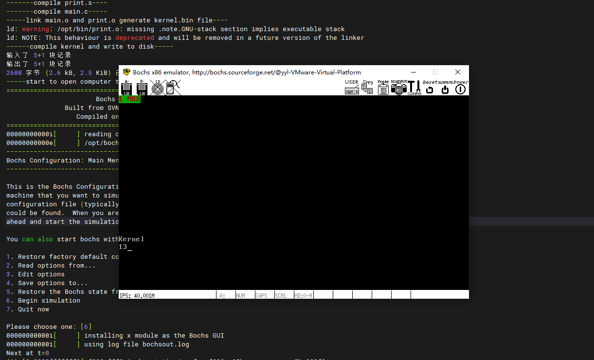

- 文本模式显示：80行，每行25个字符，共2000个字符，4000字节
- 获取光标高8位：
  
  - 1、数据在x寄存器中，x的索引是0eh
  - 2、将x的索引0eh写入到a寄存器，操作a寄存器用0x03d4端口
  - 3、out 指令将数据发给设备端口
  ```
  mov dx,0x03d4
  mov al,0x0e
  out dx,al
  ```
  - 4、拿到x起存起中的数据，要通过端口为0x03d5的寄存器
  ```
  mov dx,0x03d5
  in dx,al
  ```
  - 5、x数据存到ah
  ```
  mov ah,al
  ```
- 获取光标低8位同理。
- pushad备份8个寄存器，每个寄存器32位4字节，栈顶增加32字节
- all指令会将下一条指令地址压入栈，4字节的地址

- 运行结果：
  