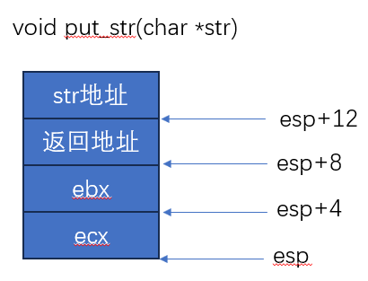
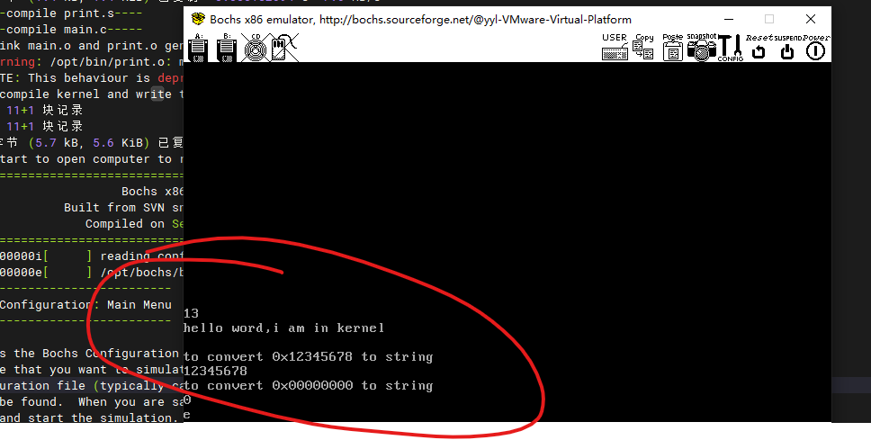

- 函数调用栈变化，依次push
  - 先push参数
  - 再push返回地址，即调用指令的下一条指令
    
- 打印字符串的思路，就是按字节取每个字符，判断是否时是0来判断是否是字符串结尾，每个字符再调用put_char
- 打印16进制，输入0x000123,输出123
  - 创建缓冲区，将转换后的值放到buffer，低位放到低地址
  - 取每4位，得到对应字符的ascii码后，调用put_char
- 运行效果：
    