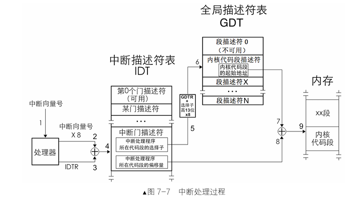

- pic:可变成中断控制器，8259A芯片是一种。外部设备将中断信号发给8259A，它处理后，把中断向量号发给cpu，cpu从IDT(中断描述符表)找到对应的处理程序信息，最终取执行处理程序。所以构建中断处理，要先对8259A进行各种配置
  


- 两个8259芯片可以构成主从级联形式
 

- 编写中断处理程序：构造一个中断处理程序数组，元素就是中断处理程序的地址。kernel.s定义了33个中断处理程序的数组
- 使用中断：
  - 第一步，初始化pic
  - 第二步，构造中断描述符表
  - 第三步，利用汇编指令将中断描述符表加载到对应的寄存器中
- 时钟中断触发效果：
  

  idt展示如下，每个中断号对应一个处理程序，用段选择子和段内偏移量表达：
  ```
  <bochs:3> info idt
  Interrupt Descriptor Table (base=0xc0003160, limit=1031):
  IDT[0x00]=32-Bit Interrupt Gate target=0x0008:0xc00018f0, DPL=0
  IDT[0x01]=32-Bit Interrupt Gate target=0x0008:0xc0001909, DPL=0
  IDT[0x02]=32-Bit Interrupt Gate target=0x0008:0xc0001922, DPL=0
  IDT[0x03]=32-Bit Interrupt Gate target=0x0008:0xc000193b, DPL=0
  IDT[0x04]=32-Bit Interrupt Gate target=0x0008:0xc0001954, DPL=0
  IDT[0x05]=32-Bit Interrupt Gate target=0x0008:0xc000196d, DPL=0
  IDT[0x06]=32-Bit Interrupt Gate target=0x0008:0xc0001986, DPL=0
  IDT[0x07]=32-Bit Interrupt Gate target=0x0008:0xc000199f, DPL=0
  IDT[0x08]=32-Bit Interrupt Gate target=0x0008:0xc00019b8, DPL=0
  IDT[0x09]=32-Bit Interrupt Gate target=0x0008:0xc00019d0, DPL=0
  IDT[0x0a]=32-Bit Interrupt Gate target=0x0008:0xc00019e9, DPL=0
  IDT[0x0b]=32-Bit Interrupt Gate target=0x0008:0xc0001a01, DPL=0
  IDT[0x0c]=32-Bit Interrupt Gate target=0x0008:0xc0001a19, DPL=0
  IDT[0x0d]=32-Bit Interrupt Gate target=0x0008:0xc0001a32, DPL=0
  IDT[0x0e]=32-Bit Interrupt Gate target=0x0008:0xc0001a4a, DPL=0
  IDT[0x0f]=32-Bit Interrupt Gate target=0x0008:0xc0001a62, DPL=0
  IDT[0x10]=32-Bit Interrupt Gate target=0x0008:0xc0001a7b, DPL=0
  IDT[0x11]=32-Bit Interrupt Gate target=0x0008:0xc0001a94, DPL=0
  IDT[0x12]=32-Bit Interrupt Gate target=0x0008:0xc0001aac, DPL=0
  IDT[0x13]=32-Bit Interrupt Gate target=0x0008:0xc0001ac5, DPL=0
  IDT[0x14]=32-Bit Interrupt Gate target=0x0008:0xc0001ade, DPL=0
  ```