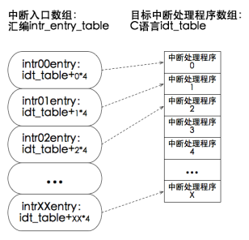

- 优化中断处理，汇编中是中断处理函数入口，真正处理只是在汇编中打印了一行字符串。此版本优化为内部处理调用c中定义的处理函数。
  

- 优化后的效果：
```
occur intterupt,vector number is 0x20,handle this
occur intterupt,vector number is 0x20,handle this
occur intterupt,vector number is 0x20,handle this
occur intterupt,vector number is 0x20,handle this
occur intterupt,vector number is 0x20,handle this
occur intterupt,vector number is 0x20,handle this
occur intterupt,vector number is 0x20,handle this
occur intterupt,vector number is 0x20,handle this
occur intterupt,vector number is 0x20,handle this
occur intterupt,vector number is 0x20,handle this
occur intterupt,vector number is 0x20,handle this
occur intterupt,vector number is 0x20,handle this
occur intterupt,vector number is 0x20,handle this
occur intterupt,vector number is 0x20,handle this
occur intterupt,vector number is 0x20,handle this
occur intterupt,vector number is 0x20,handle this
occur intterupt,vector number is 0x20,handle this
occur intterupt,vector number is 0x20,handle this
occur intterupt,vector number is 0x20,handle this
occur intterupt,vector number is 0x20,handle this
occur intterupt,vector number is 0x20,handle this
occur intterupt,vector number is 0x20,handle this
occur intterupt,vector number is 0x20,handle this
occur intterupt,vector number is 0x20,handle this
```